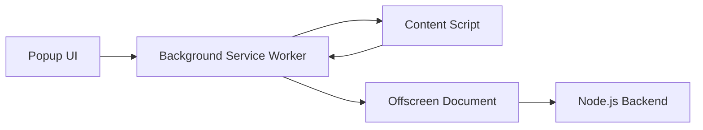

# Clueso Extension - Implementation Documentation

The Clueso Chrome Extension is a high-performance recording tool that captures screen video, microphone audio, and DOM interaction events. It streams data in real-time to the Node.js backend.

## Architecture Overview



| Component | Role |
|-----------|------|
| **Popup** | React-based UI for starting/stopping recordings |
| **Background** | Central orchestrator: state, tabs, event buffering |
| **Content Script** | DOM event capture, recording overlay |
| **Offscreen** | MediaRecorder, chunked uploads |

---

## Core Features

### 1. Intelligent Event Filtering
- **Noise Suppression**: Ignores ads, clocks, timers, overlays
- **Debounced Scrolling**: 100px threshold to prevent event flood
- **Paused State Gating**: All handlers respect `isPaused` flag

### 2. Shadow DOM Support
- **Deep Traversal**: Recursively attaches listeners to Shadow Roots
- **Composed Path**: Correctly identifies targets across Shadow boundaries
- **`>>>` Combinator**: Backend playback selector support

### 3. Recording Status Overlay
- **Pulse Indicator**: Red (recording) / Amber (paused)
- **Live Timer**: MM:SS format
- **Direct Controls**: Pause, Resume, Stop buttons on page

### 4. Multi-Tab Support & Resilience
- **Auto Re-injection**: Re-injects on tab reload
- **State Persistence**: `chrome.storage.local` for session IDs
- **Cross-Script Coordination**: Consistent state across all components

### 5. Recording Controls (Pause/Resume)
- **MediaRecorder**: Correct `.pause()` / `.resume()` invocation
- **Event Gating**: Freezes all event handlers when paused
- **Visual Sync**: Overlay and popup state stay synchronized

### 6. Enhanced Metadata Capture
- **Page Context**: `title`, `url`, `userAgent` per chunk
- **High-Res Timestamps**: Multi-track sync precision
- **Log Buffer**: Circular buffer (100 entries) for debugging

---

## Permissions

| Permission | Purpose |
|------------|---------|
| `activeTab` | Inject capture logic |
| `offscreen` | Media recording |
| `unlimitedStorage` | Large recording buffers |
| `notifications` | Status alerts |
| `tabs` | Multi-tab tracking |
| `alarms` | Keep-alive for service worker |

---

## Technical Details

| Aspect | Value |
|--------|-------|
| **Video Codec** | `video/webm; codecs=vp9` |
| **Audio Codec** | `audio/webm; codecs=opus` |
| **Video Chunk Interval** | 1000ms |
| **Audio Chunk Interval** | 2000ms |
| **Upload Method** | `FormData` multipart |
| **Dashboard URL** | `http://localhost:3001/recording/{sessionId}` |

---

## File Structure

```
Clueso_extension/
├── public/
│   ├── manifest.json      # Extension manifest (MV3)
│   ├── background.js      # Service worker
│   ├── content-script.js  # DOM event capture
│   ├── offscreen.js       # Media recording
│   └── offscreen.html     # Offscreen document
└── src/
    ├── popup/
    │   └── Popup.jsx      # React popup UI
    └── main.jsx           # Entry point
```

---

## Recent Fixes

- ✅ Added `isPaused` guards to all event handlers
- ✅ Fixed pause/resume coordination across scripts
- ✅ Enhanced metadata in chunk uploads
- ✅ Multi-tab re-injection on reload
