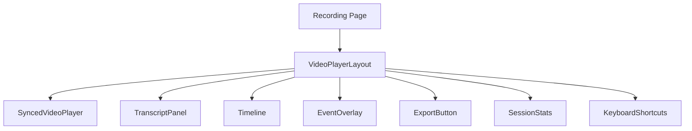

# Clueso Frontend - Implementation Documentation

The Clueso Frontend is a Next.js 16 application with React 19 that provides a recording playback interface with real-time WebSocket updates.

## Architecture Overview



## Core Features

### 1. Playback Speed Control
- Speed selector: 0.5x, 0.75x, 1x, 1.25x, 1.5x, 2x
- Synced video and audio playback rates
- Dropdown selector in video controls overlay

### 2. Keyboard Shortcuts Panel
- Press `?` to toggle shortcuts modal
- Displays all available shortcuts
- Press `Escape` to close

**Available Shortcuts:**
| Key | Action |
|-----|--------|
| Space | Play/Pause |
| ← | Seek back 5s |
| → | Seek forward 5s |
| M | Toggle mute |
| ? | Show shortcuts |

### 3. Session Analytics Card
- Duration display (MM:SS)
- Event count
- Word count from transcript
- SVG icons for visual clarity

### 4. Loading States
- `LoadingSpinner` - Animated spinner with optional text
- `VideoSkeleton` - Placeholder for video loading
- `TranscriptSkeleton` - Placeholder for transcript loading

## New Components

| Component | Path | Purpose |
|-----------|------|---------|
| KeyboardShortcuts | `components/KeyboardShortcuts.tsx` | Modal showing all shortcuts |
| SessionStats | `components/SessionStats.tsx` | Analytics card |
| LoadingSpinner | `components/LoadingSpinner.tsx` | Loading states |
| ThemeToggle | `components/ThemeToggle.tsx` | Dark/Light mode switch |

## New Pages

| Page | Path | Purpose |
|------|------|---------|
| Sessions | `app/sessions/page.tsx` | List all recorded sessions |

## Technical Details

| Aspect | Value |
|--------|-------|
| **Framework** | Next.js 16 |
| **React Version** | 19.2.0 |
| **Styling** | Tailwind CSS 4 |
| **State Management** | Zustand |
| **Real-time** | Socket.io-client |

## File Structure

```
Clueso_Frontend_layer/
├── app/
│   ├── page.tsx           # Home page
│   ├── layout.tsx         # Root layout
│   └── recording/[id]/    # Recording pages
├── components/
│   ├── VideoPlayerLayout.tsx
│   ├── KeyboardShortcuts.tsx   [NEW]
│   ├── SessionStats.tsx        [NEW]
│   ├── LoadingSpinner.tsx      [NEW]
│   ├── Timeline.tsx
│   ├── TranscriptPanel.tsx
│   └── ExportButton.tsx
└── hooks/
    └── useWebSocketConnection.ts
```

## Getting Started

```bash
cd Clueso_Frontend_layer
npm install
npm run dev
```

Visit `http://localhost:3001` to view the application.
