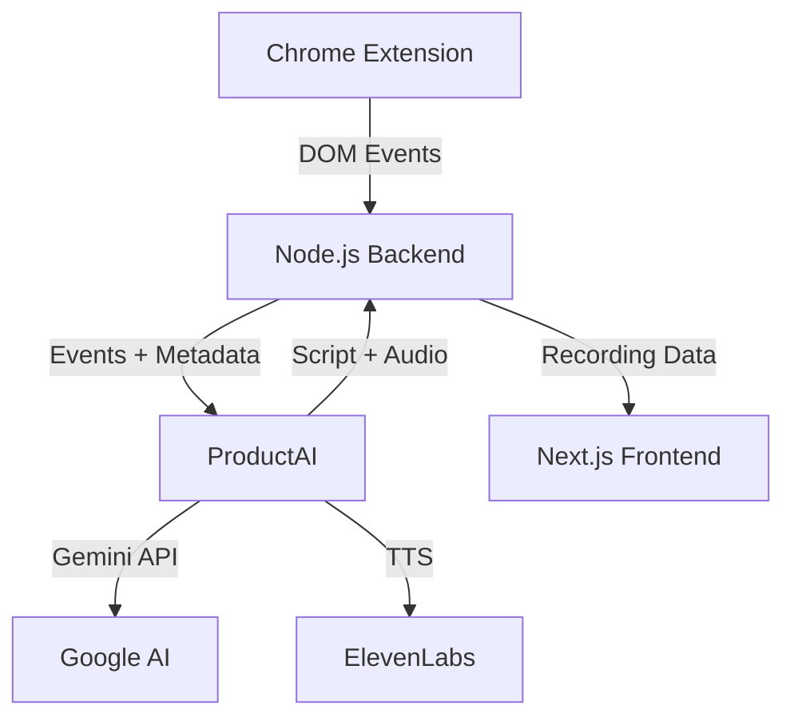

# Clueso Clone

A complete screen recording platform that transforms raw screen recordings into polished product demos with AI-powered narration, intelligent event capture, and multi-language support.

## 🎯 Overview

This project consists of four main components working together to create professional product demonstration videos:

1. **Chrome Extension** - Captures user interactions and DOM events during screen recording
2. **Node.js Backend** - Processes recordings, manages sessions, and orchestrates the pipeline
3. **Next.js Frontend** - User interface for recording management and playback
4. **ProductAI** - Python/FastAPI backend providing AI-powered features

```
clueso/
├── Clueso_extension/      # Chrome extension for event capture
├── Clueso_Node_layer/     # Node.js backend API
├── Clueso_Frontend_layer/ # Next.js web application
├── ProductAI/             # Python AI services
└── README.md              # This file
```

---

## 🔧 Tech Stack

| Component | Technology |
|-----------|------------|
| Extension | Vite + Chrome Extensions API |
| Backend | Node.js + Express + Sequelize |
| Frontend | Next.js + React + TypeScript |
| AI Services | Python + FastAPI + Gemini API |

---

## 🚀 Quick Start

### Prerequisites

- Node.js 18+
- Python 3.11+
- Chrome browser
- Gemini API key

### 1. Clone the Repository

```bash
git clone https://github.com/AbhiramVSA/clueso-clone.git
cd clueso-clone
```

### 2. Set Up Environment Variables

Create a `.env` file in the root:

```env
GEMINI_API_KEY=your_gemini_api_key
ELEVENLABS_API_KEY=your_elevenlabs_api_key
PORT=3000
```

### 3. Install Dependencies

```bash
# Node.js backend
cd Clueso_Node_layer && npm install

# Frontend
cd ../Clueso_Frontend_layer && npm install

# Extension
cd ../Clueso_extension && npm install

# ProductAI
cd ../ProductAI && pip install -r requirements.txt
```

### 4. Run the Services

```bash
# Terminal 1: Node backend
cd Clueso_Node_layer && npm run dev

# Terminal 2: Frontend
cd Clueso_Frontend_layer && npm run dev

# Terminal 3: ProductAI
cd ProductAI && uvicorn app.main:app --reload --port 8000
```

### 5. Load the Extension

1. Open Chrome → `chrome://extensions/`
2. Enable Developer Mode
3. Click "Load unpacked"
4. Select `Clueso_extension/dist` folder

### 🌐 Local URLs

| Service | URL | Description |
|---------|-----|-------------|
| Node.js API | http://localhost:3000 | Backend API |
| Frontend | http://localhost:3001 | Web dashboard |
| ProductAI | http://localhost:8000 | AI services |
| ProductAI Docs | http://localhost:8000/docs | API docs (Swagger) |

---

## 📦 Components

### Chrome Extension (`Clueso_extension/`)

Captures real-time DOM events during screen recordings:
- Click events with element context
- Scroll interactions
- Input changes
- Navigation events
- Screenshot captures

**Build**: `npm run build`  
**Output**: `dist/` folder for Chrome loading

---

### Node.js Backend (`Clueso_Node_layer/`)

RESTful API for session management and processing:

```
src/
├── config/         # Environment and database setup
├── controllers/    # Route handlers
├── middlewares/    # Request interceptors
├── repositories/   # Database queries
├── routes/         # API endpoints
├── services/       # Business logic
└── utils/          # Helpers and error classes
```

**Run**: `npm run dev`  
**Port**: 3000 (default)

---

### Next.js Frontend (`Clueso_Frontend_layer/`)

User interface for managing recordings:

```
├── app/          # Next.js app router pages
├── components/   # React components
├── hooks/        # Custom React hooks
└── lib/          # Utility functions
```

**Run**: `npm run dev`  
**Port**: 3001 (default)

---

### ProductAI (`ProductAI/`)

Python FastAPI backend with 6 AI-powered features:

| Feature | Endpoint | Description |
|---------|----------|-------------|
| **Quality Scoring** | `POST /score-quality` | Evaluates script clarity, engagement, professionalism |
| **Sentiment Analysis** | `POST /analyze-sentiment` | Detects tone issues and improvement areas |
| **Summarization** | `POST /generate-summary` | Creates executive, overview, and social snippets |
| **Analytics** | `GET /analytics/*` | Session statistics and quality trends |
| **Caching** | `GET /cache/*` | TTL-based caching for API cost reduction |
| **Translation** | `POST /translate` | Multi-language script translation |

**Run**: `uvicorn app.main:app --reload`  
**Port**: 8000  
**Docs**: http://localhost:8000/docs

---

## 📡 API Endpoints

### ProductAI Endpoints

| Method | Endpoint | Description |
|--------|----------|-------------|
| POST | `/process-recording` | Process DOM events into narration |
| POST | `/audio-full-process` | Full audio generation pipeline |
| POST | `/score-quality` | Quality scoring |
| POST | `/analyze-sentiment` | Sentiment analysis |
| POST | `/generate-summary` | Script summarization |
| POST | `/translate` | Translation |
| GET | `/analytics/overview` | Usage statistics |
| GET | `/health` | Health check |

### Node.js Endpoints

| Method | Endpoint | Description |
|--------|----------|-------------|
| POST | `/api/recordings` | Create new recording session |
| GET | `/api/recordings/:id` | Get recording details |
| POST | `/api/events` | Submit captured events |

---

## 🧪 Testing

### ProductAI Tests

```bash
cd ProductAI
uv run pytest tests/ -v
```

Test coverage:
- `test_quality.py` - Quality scoring algorithms (18 tests)
- `test_sentiment.py` - Tone detection (20 tests)
- `test_cache.py` - Cache operations (10 tests)
- `test_summarization.py` - Summary generation (12 tests)

---

## 🗂️ Architecture



### Data Flow

1. **Extension** captures user interactions during recording
2. **Node.js** receives events and manages session state
3. **ProductAI** processes events into AI-generated narration
4. **Frontend** displays recordings and enables playback

---

## 📋 Environment Variables

| Variable | Required | Description |
|----------|----------|-------------|
| `GEMINI_API_KEY` | Yes | Google AI API key |
| `ELEVENLABS_API_KEY` | No | Text-to-speech API key |
| `PORT` | No | Node.js server port (default: 3000) |

---

## 📄 Documentation

- [ProductAI Documentation](./PRODUCTAI_DOCUMENTATION.md) - AI features and services
- [Node Layer Documentation](./NODE_LAYER_DOCUMENTATION.md) - Backend middlewares and APIs
- [Extension Documentation](./EXTENSION_DOCUMENTATION.md) - Chrome extension architecture
- [Frontend Documentation](./FRONTEND_DOCUMENTATION.md) - React components and features

---

## 🤝 Contributing

1. Fork the repository
2. Create a feature branch
3. Make your changes
4. Run tests
5. Submit a pull request

---

## 📝 License

This project is part of a Clueso internship submission.

---

## 👤 Author

**Abhiram VSA**

- GitHub: [@AbhiramVSA](https://github.com/AbhiramVSA)
